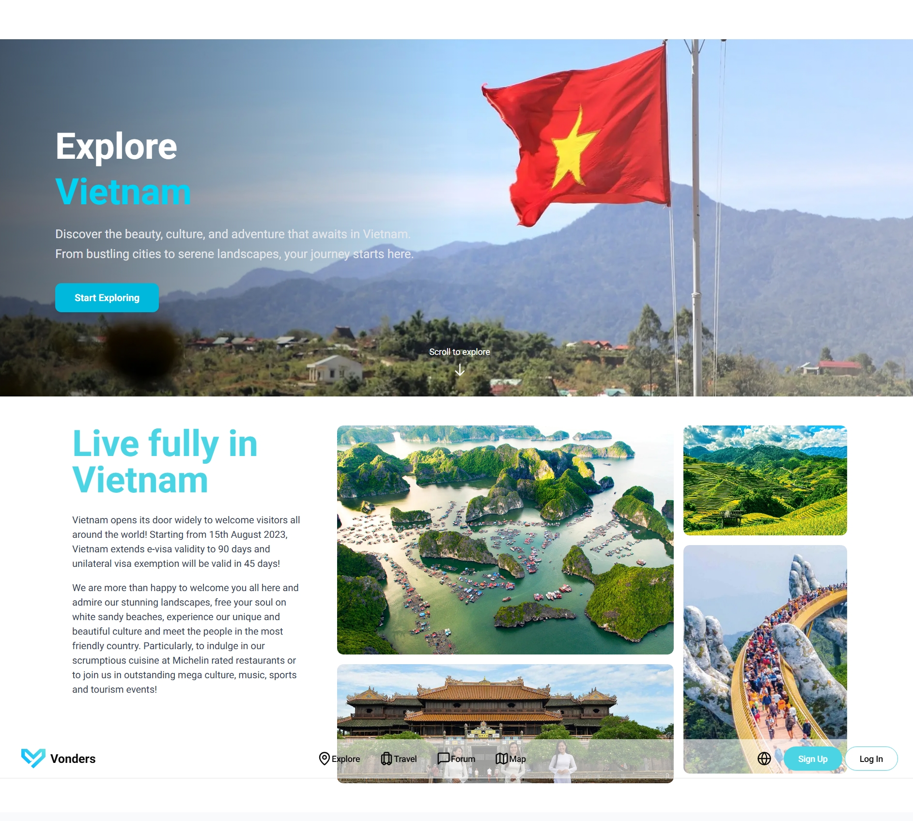

# 🌄 Vonders – Vietnam Scenic Explorer

**Vonders** is a web-based platform to explore Vietnam’s most iconic destinations, cultural events, and travel tours. It supports different user roles with rich travel features and community interaction in English and Vietnamesse.
---
**Website:** https://front-end-vonder.vercel.app
**Frontend repo:** https://github.com/dngan0365/front-end-vonder
## ⚙️ Technology Stack

- **Frontend:** Next.js (React-based)
- **Backend:** NestJS (Node.js framework)
- **Database:** PostgreSQL
- **Architecture:** RESTful API, Client–Server model

---

## 👥 User Roles & Key Features

### 🧑 Guest & User

- **Home Page:**  
  View popular destinations by region (North, Central, South) and province. Display monthly festivals and cultural events.

- **Explore Page:**  
  Filter and search locations by type (cultural, historical, religious, etc.) and events by month.

- **Location & Event Detail Pages:**  
  View detailed information about destinations and events.

- **Travel Page:**  
  Discover available tours, flights, and hotels across provinces.

- **Tour Detail Page:**  
  View detailed tour information.

---

### 🙋‍♂️ Registered User

- **Trip Planning (Location Page):**  
  - Plan trips to a location  
  - Invite other users by email  
  - Mark destinations as favorites

- **Event Saving:**  
  - Save and unsave events for later

- **Forum & Blog:**  
  - View, upvote/downvote, favorite, and comment on travel blogs  
  - Create new blogs  
  - View saved blogs

- **Tour Booking & Review:**  
  - Book tours created by agencies  
  - Write reviews for completed tours

- **Profile Management:**  
  - Update avatar, name, email  
  - View/manage created or joined trips  
  - Manage favorite destinations and saved events

- **Booking History:**  
  View all bookings filtered by: All / Upcoming / Past / Cancelled

---

### 🏢 Travel Agency

- **Authentication:**  
  Register and login as an agency

- **Tour Management:**  
  - Add, edit, delete tours  
  - Include title, description, itinerary, province, departure date, group size, price

- **Booking Management:**  
  - View bookings per tour  
  - Change status: pending / confirmed / cancelled / completed

- **Agency Profile:**  
  View and update personal information

---

### 🛠️ Admin

- **Location & Event Management:**  
  - Add, edit, delete scenic locations and cultural events

---

## ✅ Project Highlights

- Role-based access and secure authentication
- Real-time data filtering for travel planning
- Community-driven blogging and discussion
- Modular and scalable architecture

---
